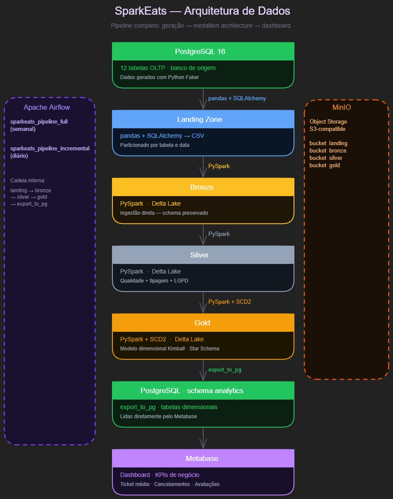

# O que é o SparkEats?

O **SparkEats** é um projeto acadêmico que simula o pipeline de dados analítico de uma plataforma de delivery (no estilo iFood/Uber Eats). O objetivo é construir toda a jornada do dado: desde a geração sintética no banco de origem até a disponibilização em um modelo dimensional para consumo em dashboard.

!!! info "Disciplina"
    Projeto final da disciplina de **Engenharia de Dados** — curso de Engenharia de Software da **UNISATC**.

---

## Modelo de Operação

O pipeline segue a **Arquitetura Medallion** em quatro camadas, orquestradas pelo Apache Airflow e armazenadas no MinIO:

=== "Landing Zone"
    Dados extraídos diretamente do PostgreSQL no formato **CSV bruto**, sem nenhuma transformação. Serve como ponto de recuperação em caso de falha nas camadas seguintes.

=== "Bronze"
    Dados convertidos para **Delta Lake** mantendo a estrutura original da origem. Nenhuma regra de negócio aplicada — apenas ingestão e persistência confiável.

=== "Silver"
    Dados **limpos, tipados e normalizados**. Deduplicação, tratamento de nulos, padronização de datas e enriquecimento leve. Base para as transformações analíticas.

=== "Gold"
    Dados no **modelo dimensional** (fatos e dimensões) prontos para consumo pelo dashboard. Contém os KPIs e métricas do negócio.

---

## Stack Tecnológica

| Camada | Ferramenta | Função |
|--------|-----------|--------|
| Origem | PostgreSQL 16 | Banco OLTP com dados de delivery |
| Geração | Faker (Python) | Massa de dados sintética realista |
| Orquestração | Apache Airflow | Agendamento e execução do pipeline |
| Processamento | Apache Spark 3.5.1 | Transformação entre camadas |
| Armazenamento | MinIO | Object storage local (Data Lake) |
| Formato | Delta Lake | Armazenamento transacional nas camadas Bronze→Gold |
| Visualização | Metabase | Dashboard analítico conectado ao schema `analytics` |
| Ambiente | Docker + Docker Compose | Containerização de todos os serviços |
| Linguagem | Python 3.12 + uv | Scripts, DAGs e dependências |

---

## Fluxo do Dado

!!! example "Jornada completa"

    1. **Geração** — `seed_database.py` popula o PostgreSQL com dados sintéticos de restaurantes, clientes, entregadores, pedidos, pagamentos e avaliações (últimos 3 anos).
    2. **Extração → Gold** — A DAG do Airflow executa todas as camadas em sequência: Landing Zone (CSV) → Bronze (Delta Lake) → Silver (limpeza) → Gold (modelo dimensional) → `export_to_pg` (exporta para o schema `analytics`).
    3. **Dashboard** — Metabase lê diretamente do schema `analytics` no PostgreSQL e exibe os KPIs.

    O pipeline é orquestrado por **duas DAGs**:

    | DAG | Frequência | Descrição |
    |-----|-----------|-----------|
    | `sparkeats_pipeline_full` | Semanal | Carga completa — reprocessa todos os dados |
    | `sparkeats_pipeline_incremental` | Diária | Carga incremental — processa apenas registros novos/alterados |

---

## Modelo de Dados (Origem)

O banco PostgreSQL possui **12 tabelas** organizadas em três categorias:

=== "Dimensões de apoio"
    - `categorias_restaurante`
    - `zonas_entrega`
    - `cupons`

=== "Entidades principais"
    - `restaurantes`
    - `cardapio`
    - `clientes`
    - `enderecos_cliente`
    - `entregadores`

=== "Transações"
    - `pedidos`
    - `itens_pedido`
    - `pagamentos`
    - `avaliacoes`

---

## Serviços e Portas

| Serviço | URL | Credenciais |
|---------|-----|-------------|
| MinIO Console | http://localhost:9091 | `minioadmin` / `minioadmin` |
| MinIO API | http://localhost:9090 | — |
| Spark Master UI | http://localhost:8080 | — |
| Spark Worker UI | http://localhost:8081 | — |
| Airflow UI | http://localhost:8082 | `admin` / `admin` |
| Metabase | http://localhost:3000 | Configurar no primeiro acesso |
| PostgreSQL | `localhost:5433` | `sparkeats` / `sparkeats_dev` |

!!! warning "Portas deslocadas"
    As portas padrão foram alteradas para evitar conflito com outros serviços no Windows/WSL. Consulte o `docker/docker-compose.yml` para detalhes.

---

## Equipe

| Nome | GitHub |
|------|--------|
| Pedro Ernesto | [@theordep](https://github.com/Theordep) |
| Vanessa Ugioni | [@vanessaugioni](https://github.com/vanessaugioni) |
| Gabriel Muller | [@GabrielNM12](https://github.com/GabrielNM12) |
| Bettina da Silva | [@Berbett](https://github.com/Berbett) |
| Carlos Eduardo | [@carloseduardob](https://github.com/carloseduardob) |

---

## Referências

- **Apache Spark 3.5.1** — [spark.apache.org/docs/3.5.1](https://spark.apache.org/docs/3.5.1/)
- **Apache Airflow** — [airflow.apache.org/docs](https://airflow.apache.org/docs/)
- **Delta Lake** — [delta.io](https://delta.io/)
- **MinIO** — [min.io/docs](https://min.io/docs/minio/container/index.html)
- **Metabase** — [metabase.com/docs](https://www.metabase.com/docs/latest/)
- **Python Faker** — [faker.readthedocs.io](https://faker.readthedocs.io/en/master/)
- **MkDocs Material** — [squidfunk.github.io/mkdocs-material](https://squidfunk.github.io/mkdocs-material/)
