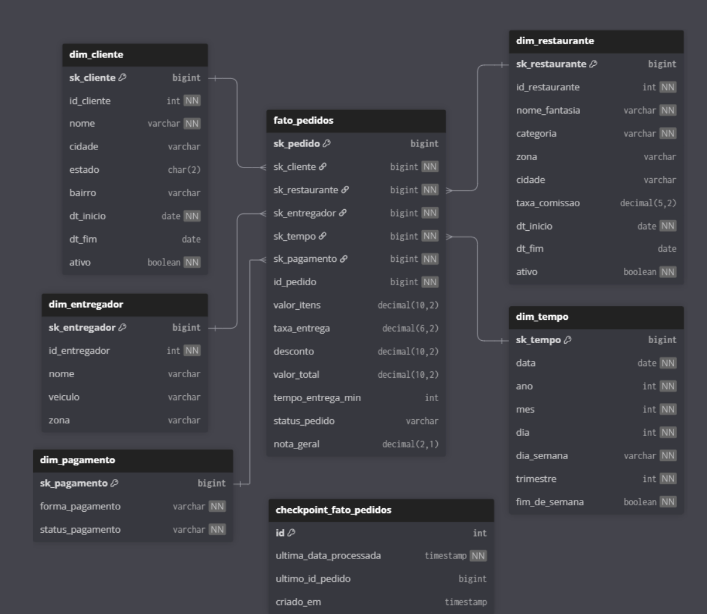

# Modelo de Dados — Origem (OLTP)

O banco de dados de origem é um PostgreSQL 16 que simula o sistema transacional de uma plataforma de delivery.

## Diagrama

## Tabelas

### Dimensões de apoio

=== "categorias_restaurante"
    | Coluna | Tipo | Descrição |
    |--------|------|-----------|
    | `id_categoria` | SERIAL PK | Identificador |
    | `nome` | VARCHAR(80) | Nome da categoria |
    | `descricao` | VARCHAR(255) | Descrição |

=== "zonas_entrega"
    | Coluna | Tipo | Descrição |
    |--------|------|-----------|
    | `id_zona` | SERIAL PK | Identificador |
    | `nome_bairro` | VARCHAR(100) | Bairro |
    | `cidade` | VARCHAR(100) | Cidade |
    | `estado` | CHAR(2) | UF |
    | `taxa_entrega` | DECIMAL(6,2) | Taxa cobrada |

=== "cupons"
    | Coluna | Tipo | Descrição |
    |--------|------|-----------|
    | `id_cupom` | SERIAL PK | Identificador |
    | `codigo` | VARCHAR(20) | Código do cupom |
    | `percentual` | DECIMAL(5,2) | Desconto % |
    | `valor_fixo` | DECIMAL(10,2) | Desconto fixo |
    | `dt_inicio` / `dt_fim` | DATE | Validade |

### Entidades principais

=== "restaurantes"
    | Coluna | Tipo | Descrição |
    |--------|------|-----------|
    | `id_restaurante` | SERIAL PK | Identificador |
    | `id_categoria` | INT FK | Categoria |
    | `id_zona` | INT FK | Zona de entrega |
    | `nome_fantasia` | VARCHAR(120) | Nome comercial |
    | `taxa_comissao` | DECIMAL(5,2) | Comissão da plataforma |
    | `status` | VARCHAR(20) | ATIVO / INATIVO / SUSPENSO |

=== "clientes"
    | Coluna | Tipo | Descrição |
    |--------|------|-----------|
    | `id_cliente` | SERIAL PK | Identificador |
    | `nome` | VARCHAR(150) | Nome completo |
    | `email` | VARCHAR(180) | E-mail (único por ativo) |
    | `cpf` | VARCHAR(14) | CPF (único) |
    | `status_ativo` | BOOLEAN | Ativo/inativo |

=== "entregadores"
    | Coluna | Tipo | Descrição |
    |--------|------|-----------|
    | `id_entregador` | SERIAL PK | Identificador |
    | `id_zona` | INT FK | Zona de atuação |
    | `veiculo` | VARCHAR(20) | MOTO / BICICLETA / CARRO |
    | `status` | VARCHAR(20) | ATIVO / INATIVO |

### Transações

=== "pedidos"
    | Coluna | Tipo | Descrição |
    |--------|------|-----------|
    | `id_pedido` | BIGSERIAL PK | Identificador |
    | `id_cliente` | INT FK | Cliente |
    | `id_restaurante` | INT FK | Restaurante |
    | `id_entregador` | INT FK | Entregador |
    | `id_cupom` | INT FK | Cupom (opcional) |
    | `status_pedido` | VARCHAR(20) | ENTREGUE / CANCELADO / EM_TRANSITO / PREPARANDO |
    | `valor_total` | DECIMAL(10,2) | Valor final |
    | `tempo_entrega_min` | INT | Tempo em minutos |

=== "pagamentos"
    | Coluna | Tipo | Descrição |
    |--------|------|-----------|
    | `id_pagamento` | BIGSERIAL PK | Identificador |
    | `id_pedido` | BIGINT FK | Pedido (1:1) |
    | `forma_pagamento` | VARCHAR(20) | PIX / CARTAO / DINHEIRO |
    | `status_pagamento` | VARCHAR(20) | APROVADO / PENDENTE / ESTORNADO |

=== "avaliacoes"
    | Coluna | Tipo | Descrição |
    |--------|------|-----------|
    | `id_avaliacao` | BIGSERIAL PK | Identificador |
    | `id_pedido` | BIGINT FK | Pedido (1:1) |
    | `nota_restaurante` | DECIMAL(2,1) | Nota 1–5 |
    | `nota_entrega` | DECIMAL(2,1) | Nota 1–5 |
    | `nota_geral` | DECIMAL(2,1) | Nota 1–5 |

## DDL completo

O script de criação está em `sql/ddl_origem_postgresql.sql`.